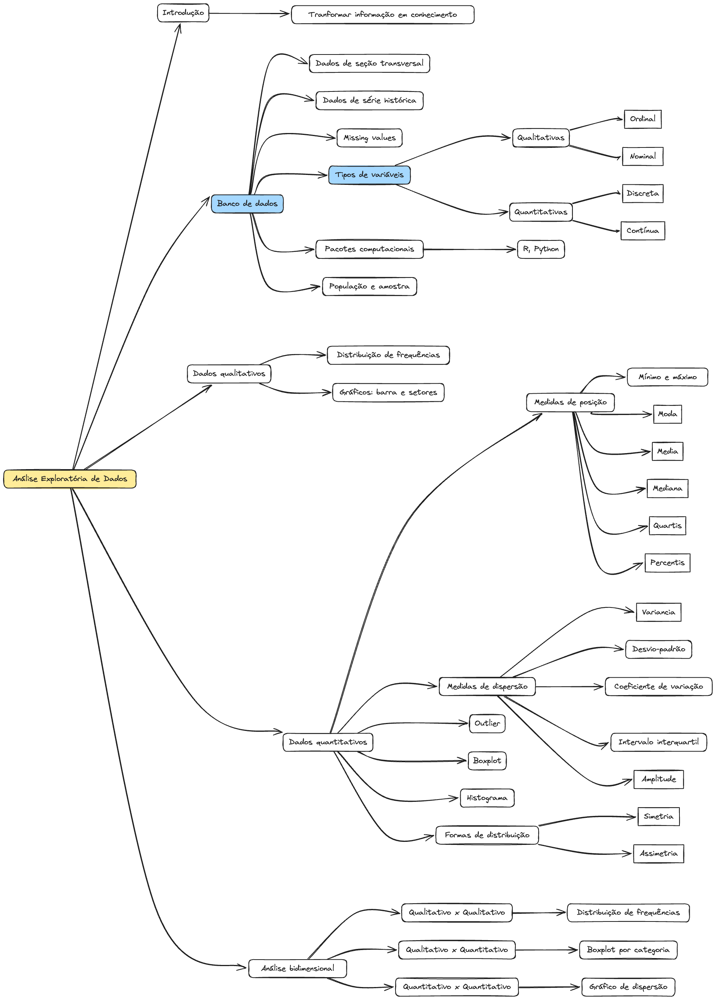

# Análise Exploratória

A análise exploratória de dados  é um processo crucial que transforma informações brutas em conhecimento valioso.&#x20;

<figure><figcaption></figcaption></figure>

Inicia-se com a compreensão dos tipos de dados, que podem ser de seção transversal ou de série histórica, e da identificação de valores ausentes. '

A categorização dos tipos de variáveis é essencial, distinguindo entre qualitativas (ordinal e nominal) e quantitativas (discreta e contínua). O

&#x20;uso de pacotes computacionais, como R e Python, facilita a manipulação e análise dos dados, considerando aspectos como população e amostra.&#x20;

A análise de dados qualitativos envolve a distribuição de frequências e a criação de gráficos de barra e setores, enquanto os dados quantitativos requerem medidas de posição (como mínimo, máximo, moda, média, mediana, quartis e percentis) e medidas de dispersão (como variância, desvio padrão e coeficiente de variação).&#x20;

A detecção de outliers e a utilização de boxplots e histogramas ajudam a entender as formas de distribuição, como simetria e assimetria.&#x20;

Por fim, a análise bidimensional permite a comparação entre variáveis qualitativas e quantitativas, utilizando gráficos de dispersão e boxplots por categoria, fornecendo uma visão abrangente dos dados analisados.
