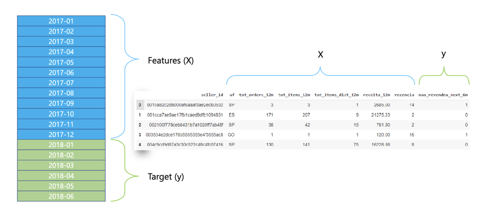

# Estrutura da ABT

A Tabela Base Analítica (ABT) é um conjunto de dados estruturado utilizado para resolver problemas específicos como churn, fraude e atraso na entrega.&#x20;

<figure><figcaption>
ABT
</figcaption></figure>

Cada linha da ABT representa uma entidade do problema, como clientes ou pedidos, e as colunas correspondem às características (features) que descrevem essas entidades, como frequência de compras, valor de pedidos, tempo de transação, entre outros.&#x20;

No contexto apresentado, a base histórica de dados utilizada para construir as features vai de 01/2017 a 06/2018, sendo que a safra de referência para essas features é de 01/2017 a 12/2017. O target, ou seja, o resultado que se deseja prever, é definido olhando 6 meses à frente, até 06/2018.&#x20;

Por exemplo, para prever o churn, a frequência e o valor das compras de um cliente são analisados para determinar se ele não revenderá nos próximos seis meses.&#x20;

Essa análise permite que algoritmos de aprendizado de máquina identifiquem padrões e façam previsões precisas sobre o comportamento futuro das entidades, auxiliando na tomada de decisões estratégicas.
